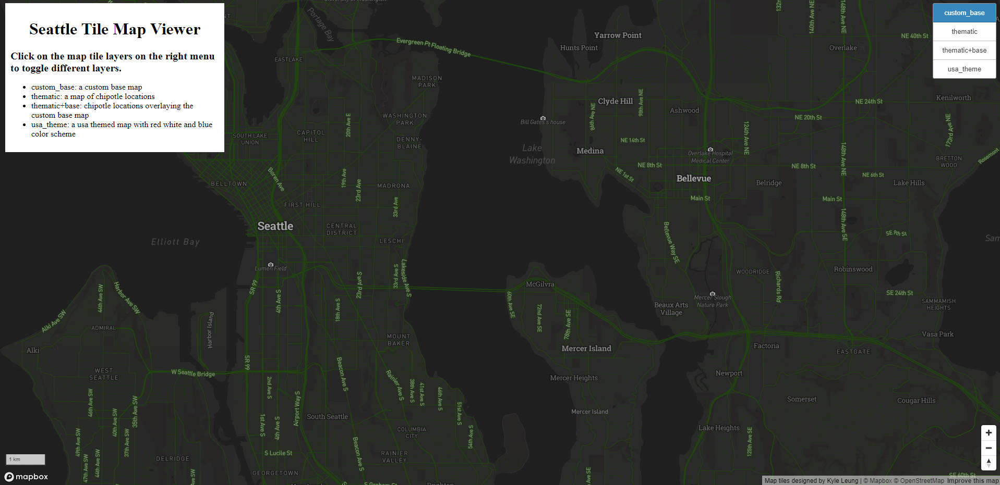
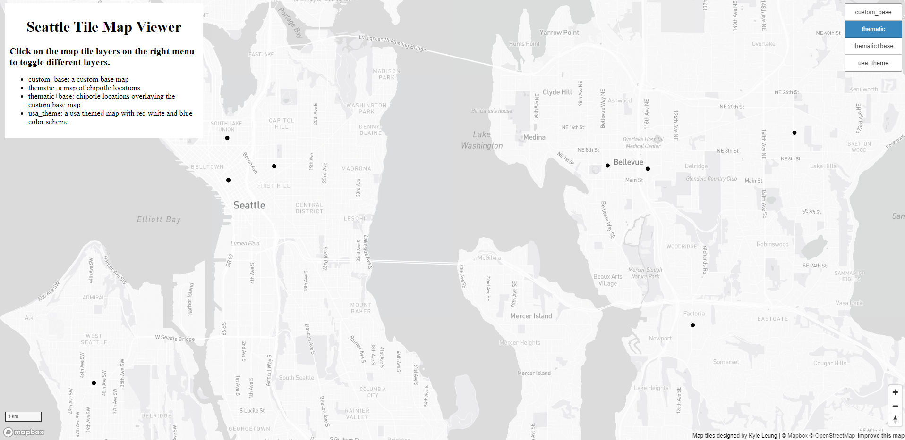
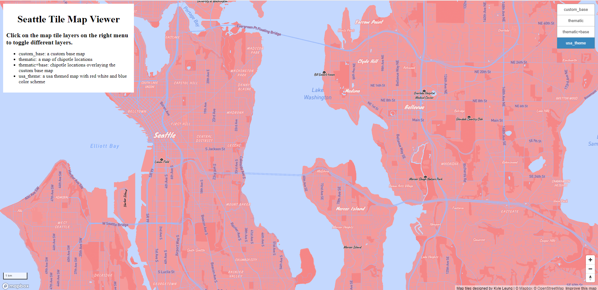
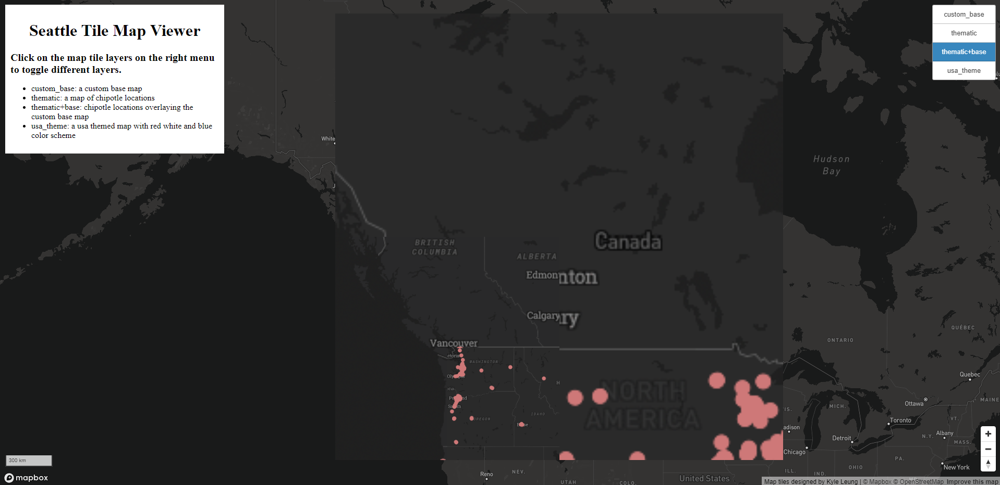
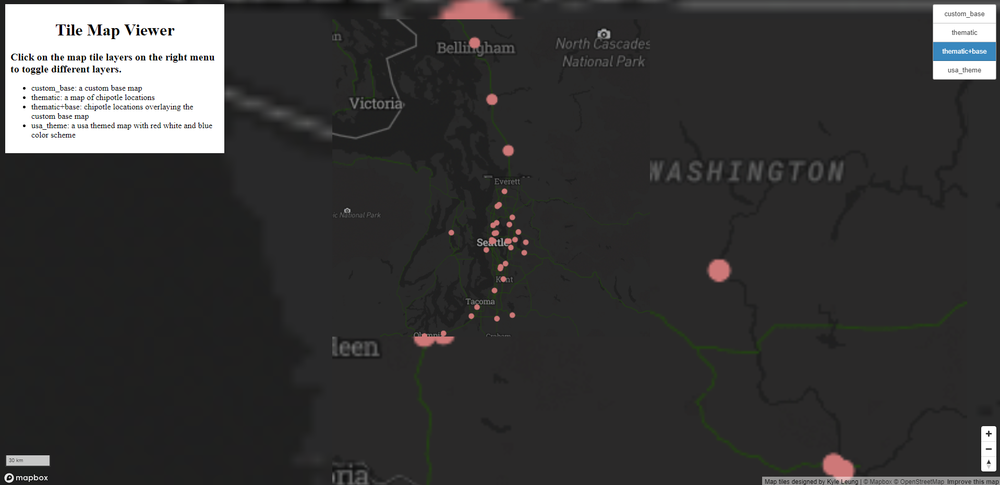
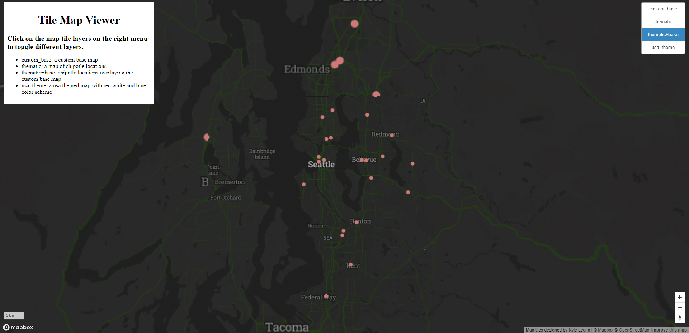
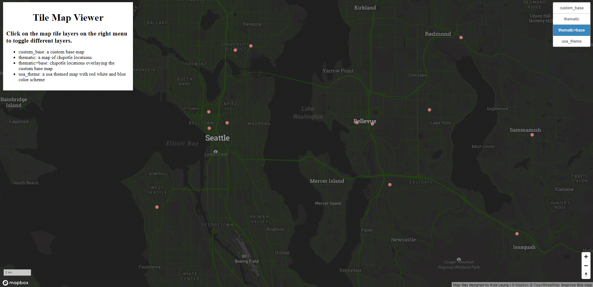
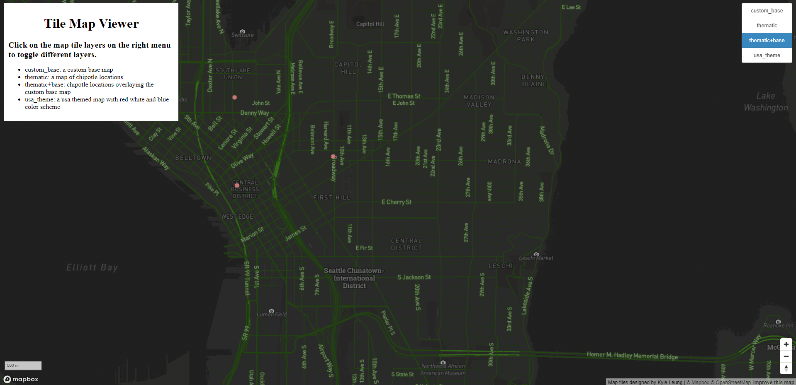

# Tile-Map-Viewer

[Click Here](https://kyleung1.github.io/Tile-Map-Viewer/) to view deployment.

The tile map viewer shows four tileset layers made using mapboxgl, mapboxstudio, and qgis. The map layers are my custom made basemap, a thematic map of chipotle locations, a thematic map of chipotle locations over the custom made basemap and a USA themed map.

## Screenshots

Monocrhome basemap with modified fonts (state and points of interest), road colors (green), icons (camera).

Dot density map of Chipotle locations over a monochrome basemap. Data is from [kaggle](https://www.kaggle.com/datasets/jeffreybraun/chipotle-locations)

Dot density map of Chipotle locations over the earlier modified basemap. Colors of the dots are changed to light pink to easily differentiate from the dark background.

USA themed map with red white and blue color scheme. The fonts of states, points of intersts, neighborhoods are changed. Icons of footballs are placed at points of interests because they represent america's favorite sport.

### Different zoom levels

Extremely zoomed out. There are relatively few tiles and less details.

Less zoomed out. Roads are visible and distribution of Chipotle locations are better seen.

Relatively zoomed out. Distribution of chipotle locations are even better seen. Minor cities start to be seen.

Relatively zoomed in. Distribution of chipotle locations are well represented and neighborhood labels begin to appear.

Closest zoom. Tiles have the most details. Road and neighborhoods are all able to be seen.

## Examined Geographic Area

> The examined geographic area is generally focused on Seattle and its surrounding area. The tiles are mostly showing seattle area and won't show much else of the rest of the state or country when zoomed out.

## Available zoom levels of each tile set

> The available zoom levels of each tile set is at a minimum of 3 and a maximum of 14. They are all the same. The zoom scale is determined by the zoom from the qgis qmetatiles plugin. The references in the above screenshots show from the outer maximum zoom level to a small portion of the minimum zoom level. As each layer is zoomed in, more and more tiles appear with smaller details. The further zoomed out you are the less tiles there are and the closer zoomed in you are the more tiles there are. Lower zoom level tiles reveal more and more details as roads, neighborhoods, road names, etc.
